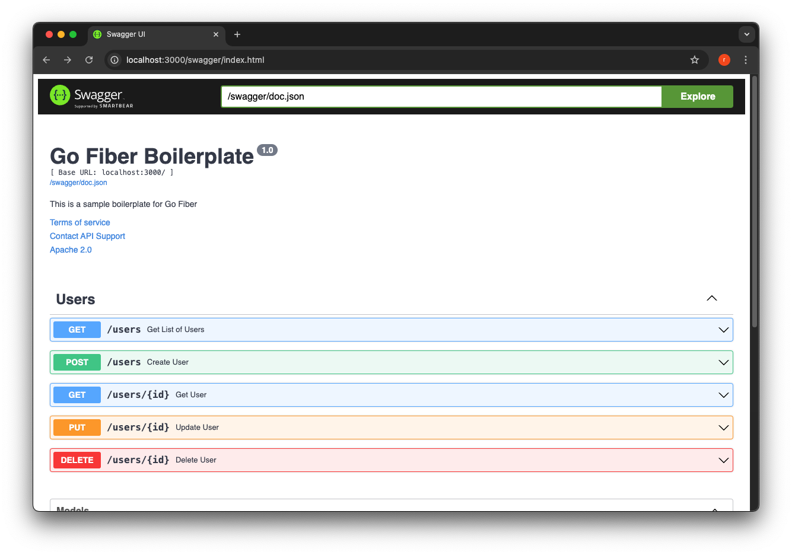

# Go Fiber Boilerplate

Go Fiber Rest Boilerplate is a starter template for building simple REST APIs using Go Fiber, GORM, and PostgreSQL. This project provides a ready-to-use setup with features like CRUD operations, pagination, and validation, following the clean architecture principles.

## Technologies Used

- **Golang**: The programming language used for this project.
- **Fiber**: An Express-inspired web framework for Golang.
- **GORM**: The ORM library for Golang.
- **PostgreSQL**: The relational database used for storing data.
- **JWT**: JSON Web Token (JWT) auth middleware
- **Google UUID**: Go package for UUIDs based on RFC 4122 and DCE 1.1: Authentication and Security Services.

## Features

- **CRUD Operations**: Predefined template for Create, Read, Update, and Delete operations.
- **Pagination**: Easy-to-use pagination for API responses.
- **Validation**: Input validation to ensure data integrity.
- **Clean Architecture**: Organized project structure following clean architecture principles.
- **Swagger**: API documentation using Swagger.



## Getting Started

### Prerequisites

- Go (version 1.16 or higher)
- PostgreSQL

### Installation

1. **Clone the repository:**

   ```bash
   git clone https://github.com/IKHINtech/go-fiber-api-boilerplate.git
   cd go-fiber-boilerplate
   ```

2. **Install dependencies:**

   ```bash
   go mod tidy
   ```

3. **Setup PostgreSQL:**

   - Create a PostgreSQL database and update the connection settings in the `config` file.

4. **Run the application:**

   ```bash
   go run main.go
   ```

### Project Structure

```bash
.
├── app
│   ├── controllers    # HTTP handlers for processing requests and returning responses
│   ├── dto            # Data Transfer Objects for request and response payloads
│   ├── mappers        # Functions to map between models and DTOs
│   ├── models         # Data models representing database tables
│   ├── repositories   # Data access layer for interacting with the database
│   ├── routes         # Route definitions and setup
│   └── services       # Business logic and service layer
├── config             # Configuration settings
├── docs               # Swagger documentation
│   ├── docs.go        # Swagger documentation generator
│   ├── swagger.json   # Swagger JSON file
│   └── swagger.yaml   # Swagger YAML file
├── database           # Database connection setup and migrations
├── utils              # Utility functions and helpers
├── middlewares        # Fiber middleware for request processing
├── routes             # Additional route definitions
├── go.mod             # Go module file
├── go.sum             # Go module dependencies
└── main.go            # Entry point of the application
```

### Contributing

Feel free to contribute to this project! Whether it's bug reports, feature requests, or pull requests, all contributions are welcome.

1. Fork the project.
2. Create your feature branch `git checkout -b feature/YourFeature`.
3. Commit your changes `git commit -m 'feat: add some YourFeature'`.
4. Push to the branch `git push origin feature/YourFeature`.
5. Open a pull request.

### License

This project is licensed under the MIT License.
